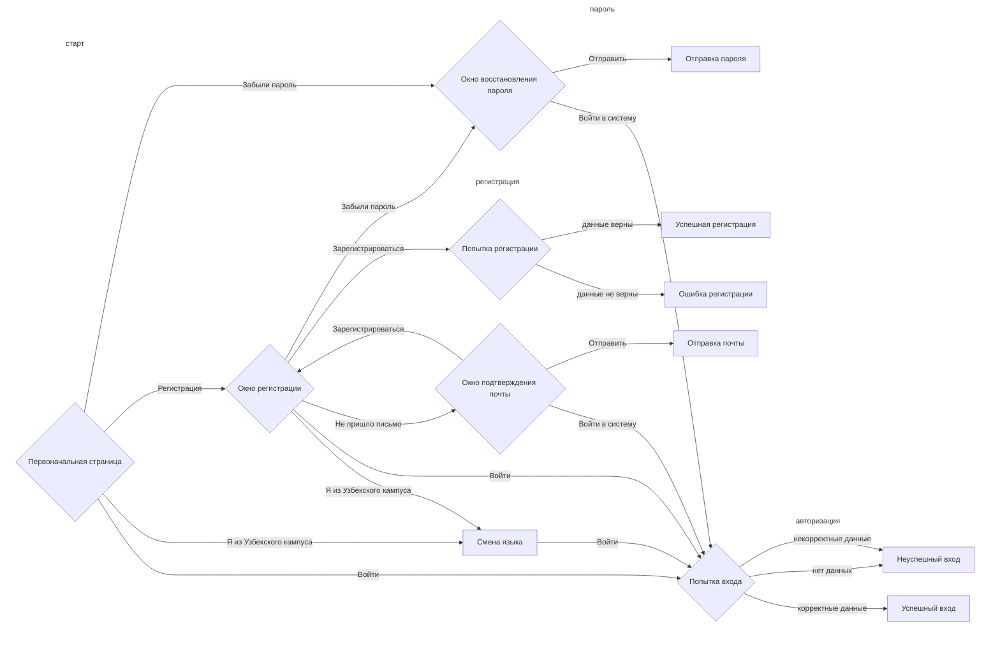

#### Диаграмма переходов и состояний

```mermaid
graph LR
    style старт fill:none,stroke:none
    style авторизация fill:none,stroke:none
    style регистрация fill:none,stroke:none
    style пароль fill:none,stroke:none
    
    subgraph старт
        A{Первоначальная страница }
    end

    subgraph авторизация
        B{Попытка входа}
        F[Неуспешный вход] 
        G[Успешный вход]
    end

    subgraph регистрация
        C{Окно регистрации}
        H{Попытка регистрации}
        I{Окно подтверждения почты}
        L[Успешная регистрация] 
        M[Ошибка регистрации] 
        N[Отправка почты]
    end

    subgraph пароль
        E{Окно восстановления пароля}
        K[Отправка пароля]
    end

    D[Смена языка] 
    
    A --> |Войти| B
    A --> |Регистрация| C
    A --> |Я из Узбекского кампуса| D
    A --> |Забыли пароль| E

    B --> |нет данных| F
    B --> |некорректные данные| F
    B --> |корректные данные| G

    C --> |Войти| B
    C --> |Зарегистрироваться| H
    C --> |Не пришло письмо| I
    C --> |Забыли пароль| E
    C --> |Я из Узбекского кампуса| D

    D --> |Войти| B

    E --> |Войти в систему| B
    E --> |Отправить| K

    H --> |данные верны| L
    H --> |данные не верны| M

    I --> |Отправить| N
    I --> |Войти в систему| B
    I --> |Зарегистрироваться| C
```

